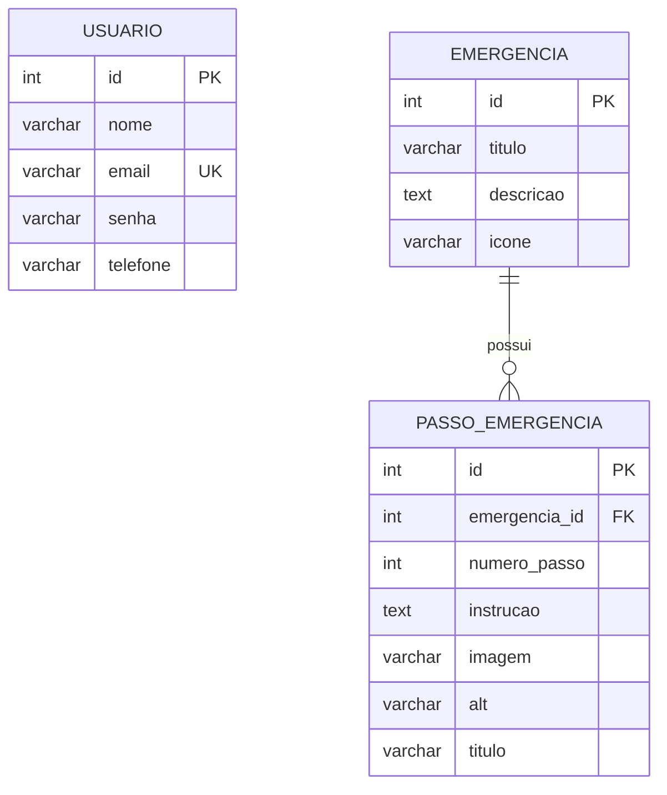

# MER — Modelo Entidade-Relacionamento (Fast Aid)

> Ticket 4 — Banco de Dados I (BDI)
> Modelo **conceitual** do banco. O código atual (`src/models`) usa arrays em memória;
> este documento descreve as tabelas que um banco real precisaria.

## 1. Diagrama

O diagrama abaixo renderiza automaticamente no GitHub (Mermaid). A mesma
definição está em [`diagrama.mmd`](./diagrama.mmd).



Para exportar uma imagem (PNG/SVG/PDF), abra [`mer.dbml`](./mer.dbml) no
[dbdiagram.io](https://dbdiagram.io) e use **Export**. O conteúdo do `.dbml`
também está reproduzido na seção 5.

## 2. Legenda

| Símbolo | Significado |
| --- | --- |
| `PK` | Chave primária (*Primary Key*) |
| `FK` | Chave estrangeira (*Foreign Key*) |
| `UK` | Valor único (*Unique Key*) |
| `||--o{` | Um (lado esquerdo) para zero ou muitos (lado direito) |

## 3. Entidades

### 3.1 Usuario

| Atributo | Tipo | Restrições | Descrição |
| --- | --- | --- | --- |
| `id` | inteiro | PK, auto-incremento | Identificador do usuário |
| `nome` | varchar(120) | NOT NULL | Nome completo |
| `email` | varchar(160) | NOT NULL, UNIQUE | Usado no login; não pode repetir |
| `senha` | varchar(255) | NOT NULL | **Hash** da senha (nunca texto puro) |
| `telefone` | varchar(20) | — | Contato do usuário |

> Sem relacionamento no escopo deste ticket. A entidade está isolada, conforme solicitado.

### 3.2 Emergencia

| Atributo | Tipo | Restrições | Descrição |
| --- | --- | --- | --- |
| `id` | inteiro | PK, auto-incremento | Identificador da emergência |
| `titulo` | varchar(120) | NOT NULL | Nome exibido (ex.: "RCP – Reanimação Cardiopulmonar") |
| `descricao` | text | — | Descrição/resumo da emergência |
| `icone` | varchar(255) | — | Caminho da imagem/ícone (ex.: `/images/rcp.png`) |

### 3.3 Passo_Emergencia

| Atributo | Tipo | Restrições | Descrição |
| --- | --- | --- | --- |
| `id` | inteiro | PK, auto-incremento | Identificador do passo |
| `emergencia_id` | inteiro | FK → `Emergencia.id`, NOT NULL | Emergência à qual o passo pertence |
| `numero_passo` | inteiro | NOT NULL | Ordem do passo (1, 2, 3...) |
| `instrucao` | text | NOT NULL | Texto da instrução a executar |
| `imagem` | varchar(255) | — | Caminho da imagem ilustrativa |
| `alt` | varchar(160) | — | Texto alternativo da imagem (acessibilidade) |
| `titulo` | varchar(160) | — | Título curto do passo |

Restrição adicional: `UNIQUE (emergencia_id, numero_passo)` — não pode haver dois
passos com o mesmo número na mesma emergência.

## 4. Relacionamentos e cardinalidades

| Relacionamento | Cardinalidade | Regra de negócio |
| --- | --- | --- |
| `Emergencia` — `Passo_Emergencia` | 1 : N | Uma emergência possui **zero ou muitos** passos; cada passo pertence a **exatamente uma** emergência. |

- **Usuario** permanece sem relacionamentos (escopo deste ticket).
- A integridade referencial é garantida pela FK `emergencia_id`; ao excluir uma
  emergência, seus passos devem ser removidos (`ON DELETE CASCADE`).

## 5. Código DBML (dbdiagram.io)

```dbml
Table Usuario {
  id        integer [pk, increment]
  nome      varchar(120) [not null]
  email     varchar(160) [not null, unique]
  senha     varchar(255) [not null, note: 'armazenar hash, nunca texto puro']
  telefone  varchar(20)
}

Table Emergencia {
  id         integer [pk, increment]
  titulo     varchar(120) [not null]
  descricao  text
  icone      varchar(255)
}

Table Passo_Emergencia {
  id             integer [pk, increment]
  emergencia_id  integer [not null]
  numero_passo   integer [not null]
  instrucao      text [not null]
  imagem         varchar(255)
  alt            varchar(160)
  titulo         varchar(160)

  indexes {
    (emergencia_id, numero_passo) [unique]
  }
}

Ref: Emergencia.id < Passo_Emergencia.emergencia_id
```

## 6. Mapeamento: código atual (arrays) → modelo real

O modelo conceitual concilia os campos pedidos no ticket com os que o app já usa.

| Código atual | Modelo real | Observação |
| --- | --- | --- |
| `usuarioModel.js` → `{ nome, email, telefone, senha }` (sem `id`) | `Usuario` (`id` + os 4 campos) | Adiciona-se a PK `id`. |
| `emergenciasModel.js` → `{ id (slug), nome, titulo, icone, passos }` | `Emergencia.id` (numérico) + `titulo`, `descricao`, `icone` | O `id` textual ("rcp") passa a ser PK numérica; `nome` vira `titulo`; `descricao` é novo. |
| `passos[]` dentro da emergência | Tabela `Passo_Emergencia` | Os passos saem do array e viram linhas ligadas por FK. |
| passo `{ imagem, alt, titulo, texto }` | `Passo_Emergencia.instrucao` (= `texto`) + `imagem`, `alt`, `titulo`, `numero_passo` | `texto` vira `instrucao`; `numero_passo` é derivado da ordem. |

### Observações de segurança

- Hoje a senha é guardada em texto puro (`usuarioModel.js`). No banco real, o
  campo `senha` deve armazenar apenas o **hash** (ex.: bcrypt), nunca a senha original.
